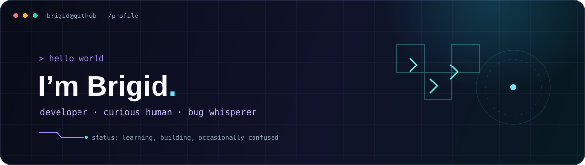

<div align="center">



### `> building things, learning loudly, debugging with snacks` 🛠️

*Welcome to my corner of the internet. The code is intentional; the number of open tabs is not.*

[](https://github.com/YOUR_GITHUB_USERNAME)
[](#currently)

</div>

---

## `$ whoami`

```yaml
name: Brigid
role: Full-Stack Software Engineer
likes:
  - making [the kinds of things you enjoy building]
  - learning [a language, tool, or topic]
  - turning “I wonder if...” into a working project
current_quest: [what you’re learning or building]
fuel: [tea / coffee / snacks of choice]
bug_status: negotiating
```

## `$ cat currently.txt`

| `FOCUS` | `TOOLKIT` | `OPEN TO` |
|:---|:---|:---|
| [What you’re working on] | [Languages and tools you use] | [Collabs, opportunities, or “just exploring”] |

## `$ ls ./projects`

<table>
<tr>
<td width="50%">

### 📦 `[PROJECT_ONE]`
**[A one-line description of what it does.]**

`[TECH_1]` · `[TECH_2]` · `[TECH_3]`

[↗ View repository](https://github.com/YOUR_GITHUB_USERNAME/PROJECT_ONE)

</td>
<td width="50%">

### 🧪 `[PROJECT_TWO]`
**[What problem it solves or what you learned making it.]**

`[TECH_1]` · `[TECH_2]` · `[TECH_3]`

[↗ View repository](https://github.com/YOUR_GITHUB_USERNAME/PROJECT_TWO)

</td>
</tr>
</table>

*Replace these project cards with your pinned repos—or let them hang out here until their big debut.*

## `$ ./fun_facts.sh`

- Compiles best after a walk.
- “One quick fix” is a phrase with flexible runtime.
- Thinks good documentation is a love language.

## `$ ping brigid`

Got an idea, a cool project, or an unusually interesting bug? **[Reach me here](YOUR_CONTACT_OR_SOCIAL_LINK)**.

<div align="center">

*Thanks for stopping by. May your builds be green and your tabs be, uh, manageable.* 

</div>
